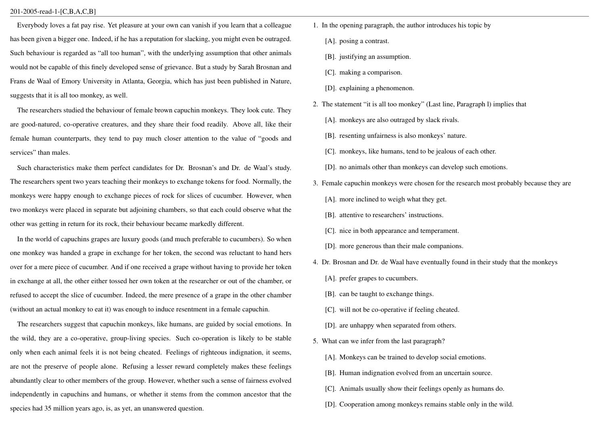

# 未校对的考研英语部分真题集
## 注：该份真题集未校对，可能存在诸多错误，谨慎使用
包含的内容有 
* 英语一（201），2005-2023年完型、阅读
* 英语二（204），2010-2023年完型、阅读
---

布局如图所示，文章和选项在同一页



---
可以通过运行 `random_aws.py` 对选项进行打乱，同时会生成对应的答案
```bash
python random_aws.py
```
然后重新生成pdf即可
```bash
latexmk -pdf -pdflatex .\main.tex
```